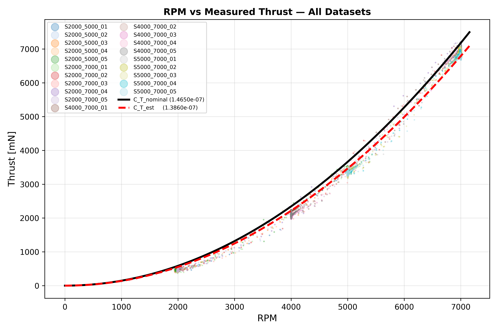

# drone_simulator_pkgs

## 1. Install gazebo fortress

Go to the following site, and then, install it.
```
https://gazebosim.org/docs/fortress/install_ubuntu/
```

## 2. Install dependent pkgs

```
sudo apt install ros-humble-ros-gz*
```

Go to the repo and build ros2_libcanard first.
```
https://github.com/kay01-kwon/ros2_libcanard_pkgs
```

ros_motor_model pkg depends on the message type named "ros2_libcanrad_msgs".

## 3. Install this packages.

```
mkdir -p ~/rotor_sim_ws/src
```

```
cd ~/rotor_sim_ws/src
```

```
git clone https://github.com/kay01-kwon/drone_simulator_pkgs.git
```

```
cd ~/rotor_sim_ws/
```

```
colcon build --packages-select drone_description drone_gazebo drone_bringup ros_motor_model --symlink-install
```

## 4. Launch

```
source install/setup.bash
```

```
ros2 launch drone_bringup s550_empty.launch.py
```

## 5. Reset pose of model

```
ign service -s /world/S550_world/set_pose --reqtype ignition.msgs.Pose --reptype ignition.msgs.Boolean --timeout 5000 --req 'name: "S550" position: {x: 0.0, y: 0.0, z: 1.0} orientation: {w: 1.0, x: 0.0, y:0.0, z:0.0}'
```

## 6. Motor constant

$C_{T,rps}$ (unit: $\frac{N}{(rad/s)^2}$)

Experiment $C_{T,rpm} = 1.386 \cdot 10^{-7} \frac{N}{(rpm)^2}$

Conversion

$C_{T,rps} = C_{T,rpm}\cdot (\frac{60}{2\pi})^2$

$ \therefore C_{T,rps} = 1.2639\cdot 10^{-5} \frac{N}{(rad/s)^2}$



